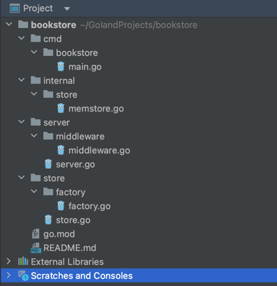
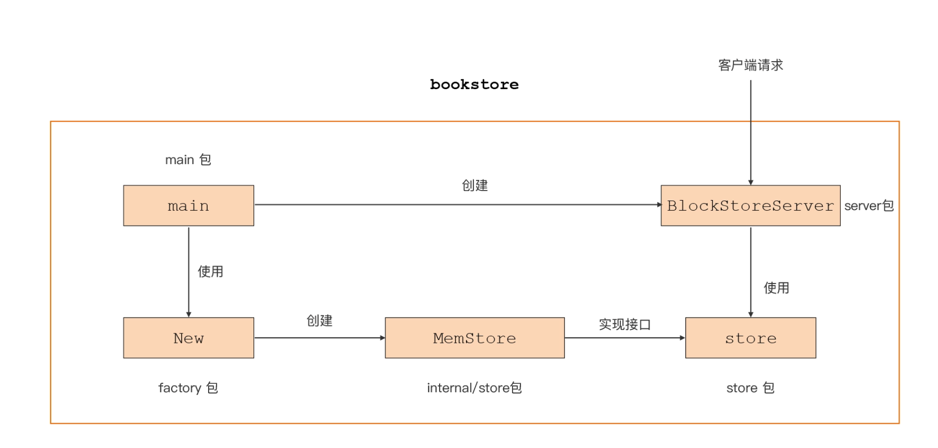

# 图书管理项目

## 项目布局
```

├── cmd/
│   └── bookstore/         // 放置bookstore main包源码
│       └── main.go
├── go.mod                 // module bookstore的go.mod
├── go.sum
├── internal/              // 存放项目内部包的目录
│   └── store/
│       └── memstore.go     
├── server/                // HTTP服务器模块
│   ├── middleware/
│   │   └── middleware.go
│   └── server.go          
└── store/                 // 图书数据存储模块
    ├── factory/
    │   └── factory.go
    └── store.go
```




## main 逻辑
